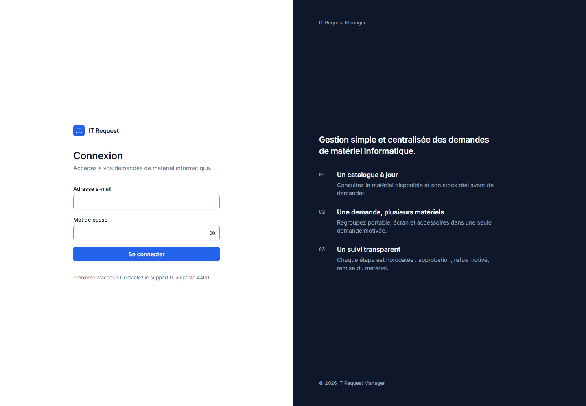
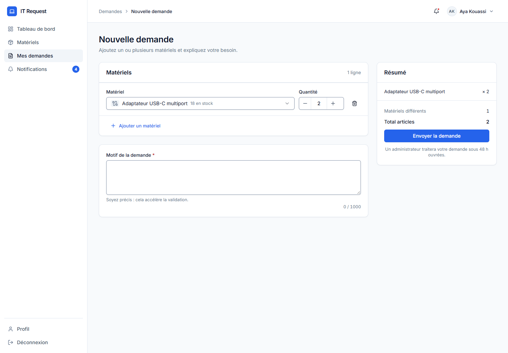
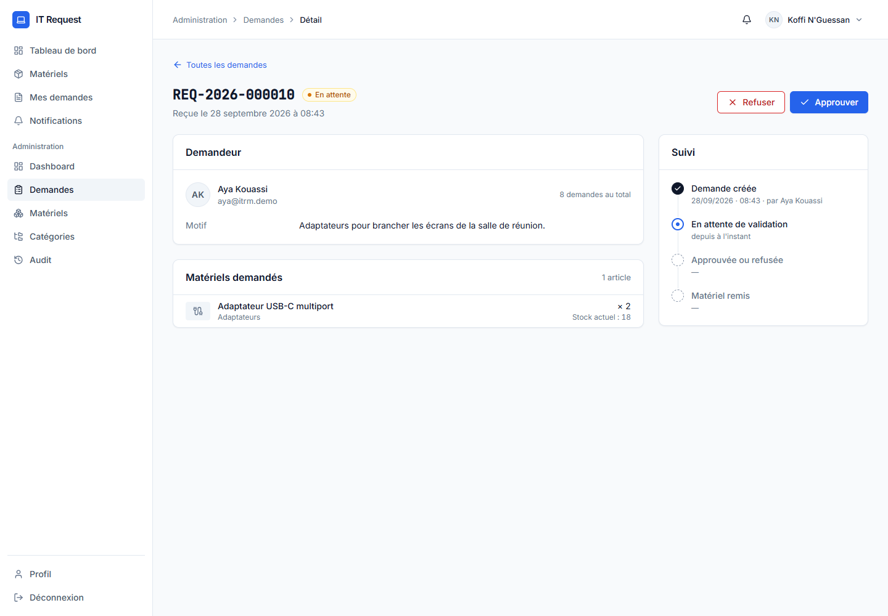
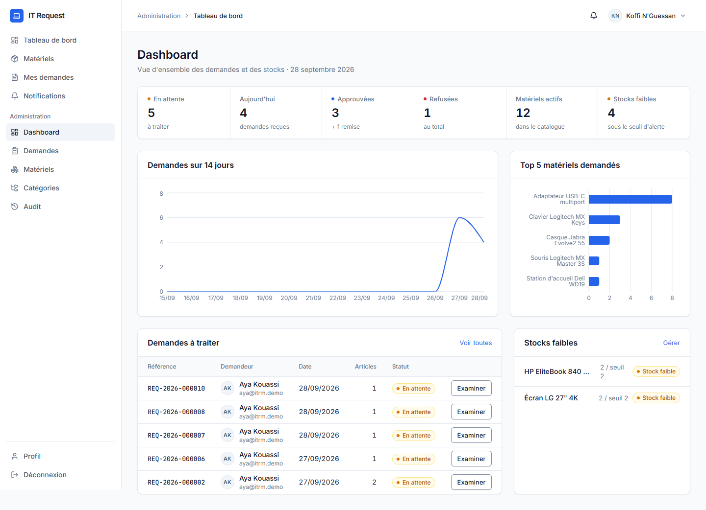
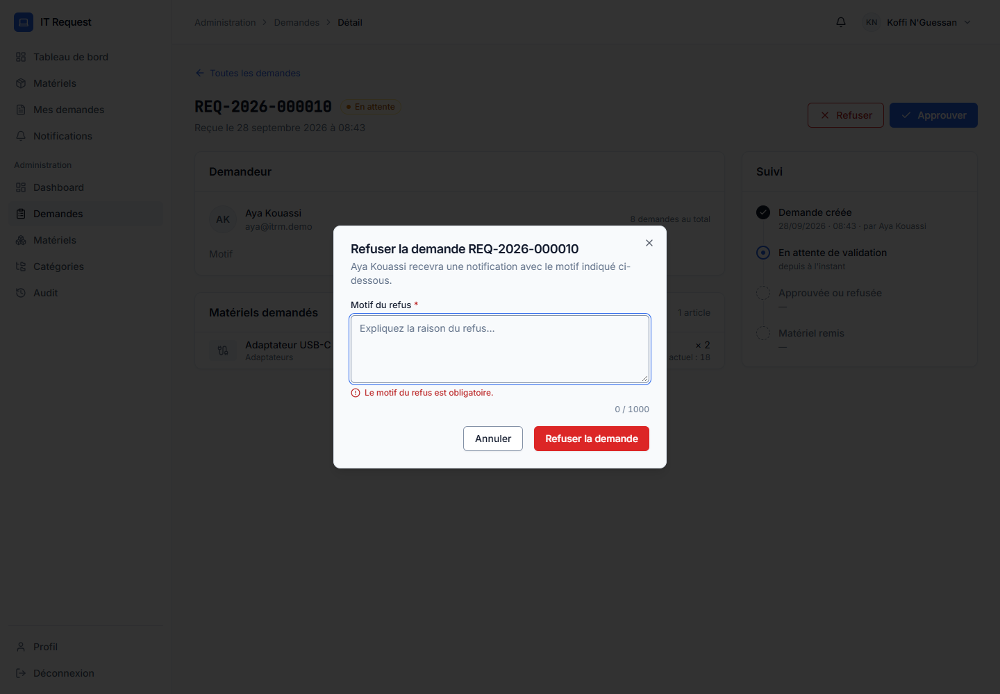
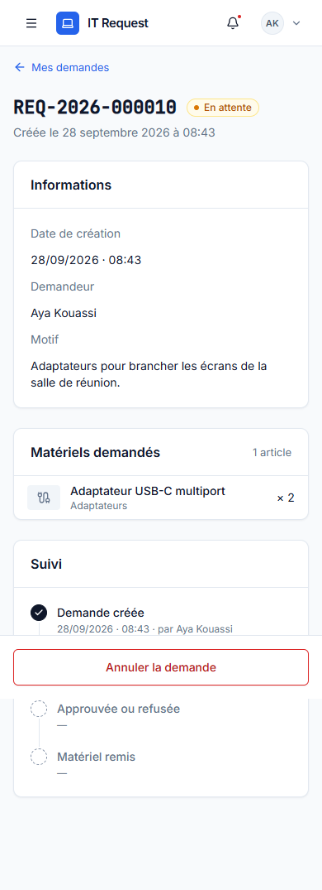

# IT Request Manager

**Gestion simple et centralisée des demandes de matériel informatique.**

Un collaborateur consulte le catalogue (portables, écrans, accessoires…), compose une demande
de plusieurs matériels avec un motif, puis suit son traitement. Un administrateur approuve —
ce qui décrémente le stock de façon atomique —, refuse avec un motif obligatoire, ou marque le
matériel comme remis. Chaque étape est historisée, notifiée et auditée.


---

## Architecture (3 tiers, monolithe modulaire)

```
┌──────────────────────────────────────────────┐
│  apps/web — PRÉSENTATION                     │  React 19 + Vite, JSX, Tailwind 3.4, shadcn/ui
│  Écrans, formulaires, cache (TanStack Query) │  SDK Supabase : authentification UNIQUEMENT
└──────────────────────┬───────────────────────┘
                       │  HTTP REST / JSON — Authorization: Bearer <access_token>
┌──────────────────────▼───────────────────────┐
│  apps/api — MÉTIER                           │  Express 5 (ESM), zod, helmet, cors
│  route → middlewares (auth, rôle, validation)│
│        → contrôleur → service                │  clé service_role (serveur uniquement)
└──────────────────────┬───────────────────────┘
                       │  supabase-js : requêtes + appels RPC
┌──────────────────────▼───────────────────────┐
│  supabase/ — DONNÉES                         │  PostgreSQL + Auth + Storage
│  Tables, contraintes, RLS « deny all »,      │  Écritures critiques = fonctions PL/pgSQL
│  fonctions RPC transactionnelles             │  (transaction, verrous FOR UPDATE)
└──────────────────────────────────────────────┘
```

Le navigateur ne parle **jamais** directement aux données : la clé anon ne donne accès à rien
(RLS activée sans policy). Toute donnée passe par l'API, qui vérifie le token, lit le rôle en
base et valide chaque entrée.

## Stack et justification

| Couche | Choix | Pourquoi |
|---|---|---|
| Langage | JavaScript (ESM) + JSDoc | Aucun TypeScript : la forme des données est documentée en JSDoc (`@typedef`). |
| API | **Express 5** | Plus simple à expliquer en JavaScript que NestJS ; les couches sont explicites et visibles. Express 5 transmet nativement les erreurs des fonctions `async`. |
| Validation | **zod** (API et front) | Mêmes règles des deux côtés, messages en français. |
| Données | **Supabase** (PostgreSQL) | Auth prête à l'emploi, Storage, et surtout des fonctions SQL transactionnelles. |
| Front | **React + Vite**, React Router 6 | Standard, rapide, sans configuration lourde. |
| UI | **Tailwind 3.4 + shadcn/ui** (JSX) | Composants accessibles (Radix), tokens du design system branchés sur les variables shadcn. |
| Données front | **TanStack Query** | Cache, états chargement / erreur, invalidation après mutation. |
| Formulaires | **React Hook Form + zod** | Validation déclarative, `aria-invalid` / `aria-describedby`. |
| Tests | **Vitest**, Supertest, Testing Library | Un seul outil de test pour l'API et le front. |

## Installation

Prérequis : Node.js 20+, un projet Supabase.

```bash
# 1. Dépendances (npm workspaces : API + web en une commande)
npm install

# 2. Base de données (une seule fois) : migrations puis données de référence
supabase link --project-ref <ref>
supabase db push                    # applique supabase/migrations/*.sql
# puis exécuter supabase/seed.sql dans le SQL Editor (catégories + matériels)

# 3. Variables d'environnement
cp apps/api/.env.example apps/api/.env   # SUPABASE_URL, SUPABASE_SERVICE_ROLE_KEY
cp apps/web/.env.example apps/web/.env   # VITE_SUPABASE_URL, VITE_SUPABASE_ANON_KEY, VITE_API_URL

# 4. Comptes et demandes de démo (idempotent)
npm run seed:demo

# 5. Lancement : API (3000) + web (5173)
npm run dev
```

| Variable | Où | Rôle |
|---|---|---|
| `SUPABASE_URL` | `apps/api/.env` | URL du projet |
| `SUPABASE_SERVICE_ROLE_KEY` | `apps/api/.env` **uniquement** | Contourne la RLS — ne quitte jamais le serveur |
| `PORT`, `WEB_URL` | `apps/api/.env` | Port de l'API, origine autorisée par CORS |
| `VITE_API_URL` | `apps/web/.env` | `http://localhost:3000/api/v1` |
| `VITE_SUPABASE_URL`, `VITE_SUPABASE_ANON_KEY` | `apps/web/.env` | Authentification seulement (clé publique) |

Autres commandes : `npm test` (API + web), `npm run lint`, `npm run build` (front).

## Comptes de démo

| Rôle | E-mail | Mot de passe |
|---|---|---|
| Administrateur | `admin@itrm.demo` | `Admin123!` |
| Collaboratrice | `aya@itrm.demo` | `User123!` |
| Collaborateur | `yao@itrm.demo` | `User123!` |

## Endpoints principaux

Documentation interactive : **http://localhost:3000/api/docs** (Swagger, `apps/api/docs/openapi.yaml`).

| Méthode | Route | Rôle |
|---|---|---|
| GET | `/health` | public |
| GET | `/auth/me` | profil et rôle |
| GET | `/materials`, `/materials/:id`, `/categories` | catalogue (actifs uniquement) |
| POST | `/requests` | création (RPC `create_request`) |
| GET | `/requests/me`, `/requests/:id` | mes demandes (404 si la demande est à un autre) |
| PATCH | `/requests/:id/cancel` | annulation (RPC `cancel_request`) |
| GET/PATCH | `/notifications…` | liste, compteur, lecture |
| GET | `/admin/requests`, `/admin/requests/:id` | ADMIN — liste, détail avec stock actuel |
| PATCH | `/admin/requests/:id/approve` · `/reject` · `/fulfill` | ADMIN — décisions (RPC) |
| GET/POST/PUT/PATCH | `/admin/materials…`, `/admin/categories…` | ADMIN — gestion + audit |
| GET | `/admin/dashboard`, `/admin/audit` | ADMIN — indicateurs, journal |

Erreurs : `{ statusCode, code, message, details? }`, message en français.
Listes : `{ data, meta: { page, limite, total, totalPages } }`, `limit` ≤ 50.

## Choix techniques

**Écritures critiques dans des fonctions PostgreSQL (RPC).** supabase-js ne sait pas faire de
transaction multi-requêtes. `approve_request` verrouille la demande puis les lignes de stock
(`SELECT … FOR UPDATE`, dans un ordre déterministe pour éviter les interblocages), vérifie le
stock, le décrémente, change le statut, écrit l'historique, la notification et l'audit — **tout
ou rien**. Deux administrateurs qui approuvent en même temps sont sérialisés ; le second voit le
stock déjà décrémenté ou la demande déjà approuvée et reçoit un **409**.

**Double contrôle de la machine d'état.** `machineEtat.js` refuse tôt une transition impossible
(erreur rapide et testée) ; la base revérifie sous verrou (garantie finale).

**service_role côté serveur uniquement.** La clé qui contourne la RLS n'existe que dans
`apps/api/.env`. Le front n'a que la clé anon, qui ne sert qu'à se connecter.

**RLS en « deny all ».** RLS activée sur toutes les tables, sans aucune policy, et droits
révoqués pour `anon` / `authenticated`. Même si la clé anon fuit, elle ne lit rien.

**Rôle lu en base.** Le rôle vient de `profiles.role`, jamais de `user_metadata`
(modifiable par l'utilisateur). Le menu Administration côté front n'est que du confort visuel :
l'API répond 403 à un USER sur `/admin/*`.

**Références par séquence.** `REQ-AAAA-NNNNNN` est tiré d'une `SEQUENCE` PostgreSQL : jamais
deux fois la même valeur, même sous forte concurrence (contrairement à `COUNT(*) + 1`).

**JSON en français.** Les colonnes SQL restent en anglais (contrat figé) ; `utils/convertisseurs.js`
expose un JSON camelCase français (`quantiteDisponible`, `statut`…).

## Captures

| Connexion | Nouvelle demande | Détail (admin) |
|---|---|---|
|  |  |  |
| **Dashboard admin** | **Refus : motif obligatoire** | **Mobile** |
|  |  |  |

## Tests

- **API (68)** : machine d'état (25 transitions), traduction des erreurs RPC → HTTP,
  validation zod, middlewares (sans token / token invalide → 401, USER sur `/admin` → 403),
  Supertest sur `/health` et sur l'approbation avec stock insuffisant (409).
- **Web (18)** : `BadgeStatut` en français, schéma de la nouvelle demande, validation du
  formulaire de connexion.
- Parcours complet vérifié dans Chrome (collaborateur puis admin, desktop et mobile) sans
  aucune erreur console.

## Limites et évolutions possibles

- **Écart base déployée / migrations du dépôt** : sur le projet Supabase fourni, les fonctions
  de statistiques s'appellent `user_dashboard_stats` / `admin_dashboard_stats`,
  `create_request` renvoie `{ id, status, reference }` et le détail de `INSUFFICIENT_STOCK` est
  un tableau JSON. L'API accepte les deux variantes (commentaires dans le code) ; il faudrait
  réaligner les fichiers de migration sur la base réelle.
- Les écritures admin sur matériels et catégories et leur ligne d'audit sont deux requêtes
  distinctes (pas de transaction) ; une RPC dédiée rendrait l'audit atomique.
- Pas de réinitialisation de mot de passe ni de gestion des utilisateurs dans l'interface.
- Le sélecteur de la nouvelle demande charge au plus 50 matériels (plafond de l'API).
- Évolutions : export CSV, notifications temps réel (Supabase Realtime), tests end-to-end
  Playwright, intégration continue GitHub Actions.
